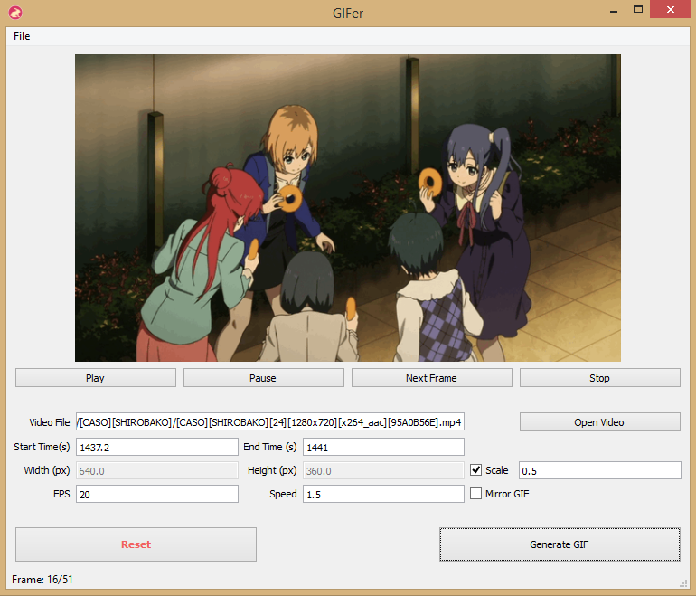
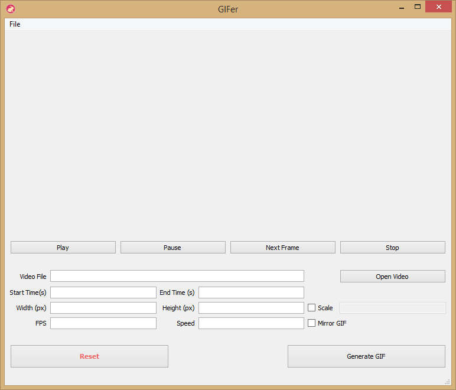

#  GIFer, a GIF animation maker

## Screenshots

Screenshot with generated GIF



Screenshot on start.



## Parameters Overview
Generate GIF animations with some most useful parameters:
- *Video File*, the video source file to generate GIF.
- *Start Time*, in second, starting time of animation in video file,
  default is zero.
- *End Time*, in second, ending time of animation in video file, default is total
  seconds of video file.
- *Width*, in pixel, width of animation, default is original video size.
- *Height*, in pixel, height of animation, default is original video size.
- *Scale*, determine animation size by multiplying (width, height) with Scale
  parameter, e.g. 0.5.
- *FPS*, frames per second of animation, default is video's original fps.
- *Speed*, play speed of animation, default is 1.0, which means keeping the
  the video's speed.
- *Mirror GIF*, make time symmetric GIF animation.

## Gallery
Don Don Donuts, Do-n to Ikou!


## How to

### Portable binary file
- Windows 64 binary file: [Download](https://github.com/mikkkee/gifer/releases/download/v0.1.1/gifer.0.1.1.win64.binary.exe.zip)
- Windows 32 binary file: [Download](https://github.com/mikkkee/gifer/releases/download/v0.1.1/gifer.0.1.1.win32.binary.exe.zip)

### Play with GIFer

#### Requirements

GIFer is written in Python 2.7 and is not compatible with Python 3.x.
GIFer uses [MoviePy](https://github.com/Zulko/moviepy) to make GIF animations.
The GUI is made using [PyQt4](http://www.riverbankcomputing.com/software/pyqt/download).
PIL (Python Imaging Library) is required to resize GIF animation.

##### Install Requirements
1. Install [SIP](http://www.riverbankcomputing.com/software/sip/download).
2. Install [PyQt4](http://www.riverbankcomputing.com/software/pyqt/download).
3. Install MoviePy, `pip install moviepy`.
4. Install [Pillow](http://pillow.readthedocs.org/en/latest/) (A PIL branch, 
   recommended), `pip install Pillow`.

#### Run From Source
You don't need to pack GIFer into a executable to play with it.

Just run `python gifer.py` to start making GIFs. 

You can choose to build a portable executable file whenever you want following 
the steps below..

#### Build
If you have not modified MoviePy using script files in ./scripts/, please
remember to set `__FRESH__` to `True` in `build.py`, this will inform GIFer
that it's dealing with a freshly installed MoviePy module. GIFer will then
modify MoviePy before building executable files and restore all changes after
building. After this, just run:

`python build.py`

in the same directory of `gifer.py`.

#### Debug
GIFer captures console output to display message on its UI; you need to stop
this capturing behavior to see error traceback codes.

Comment out
```python
sys.stdout = ConsoleCapture(
              text_written=self.update_status_bar_gif_progress)
```
in `gifer.py` to stop GIFer from capturing console outputs. Remember to restore
this change after you've done your debugging, or GIFer will not be able to
display animation creating progress.


## Icon Credit
The GIFer Icon was made based on the
[rabbit icon](http://www.flaticon.com/free-icon/rabbit-facing-right_84025) by
[Freepik](http://www.flaticon.com/authors/freepik) from
[www.flaticon.com](http://www.flaticon.com)
